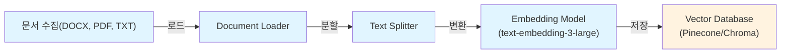
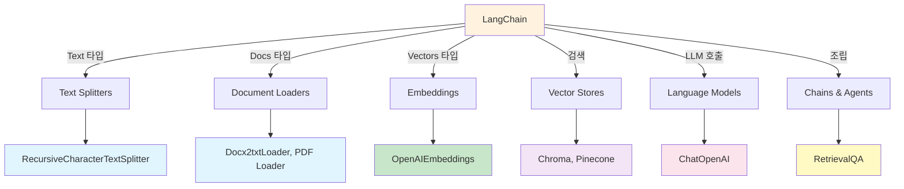
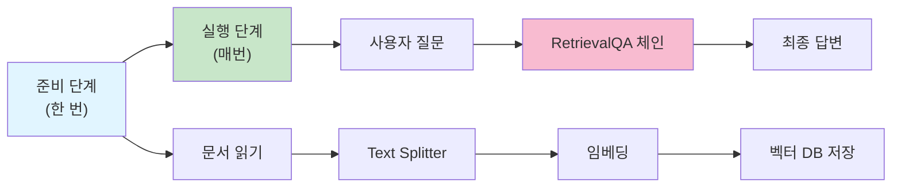

# LangChain을 활용한 RAG(Retrieval Augmented Generation) 완벽 가이드

## 📚 개요

이 가이드는 LangChain 프레임워크를 통해 RAG(Retrieval Augmented Generation) 시스템을 처음부터 구축하는 방법을 **개념** → **설계** → **구현** 순서로 상세히 설명합니다.

RAG는 현재 가장 실용적인 LLM 응용 기술입니다. 기존 LLM의 한계(outdated knowledge, hallucination)를 극복하기 위해 외부 문서를 활용하여 답변의 정확성과 신뢰성을 높입니다.

---

## 🎯 RAG의 핵심 개념

### 💡 RAG가 해결하는 문제들

#### 1. **LLM의 지식 한계 (Knowledge Cutoff)**
```
문제: ChatGPT는 학습 데이터 기준(2023년)까지의 정보만 알고 있음
예: "2024년의 최신 세금 법안은?"에 답할 수 없음

해결: RAG로 최신 문서를 검색하여 LLM에 제공
```

#### 2. **할루시네이션 (Hallucination)**
```
문제: LLM이 그럼듯한 거짓 정보를 마치 사실인 것처럼 답변
예: 존재하지 않는 법률을 인용하거나, 틀린 세율 제시

해결: 실제 문서를 기반으로 답변하도록 강제
```

#### 3. **도메인 특화 정보 부족**
```
문제: 일반 학습 데이터에는 회사의 내부 문서, 규정이 없음
예: "우리 회사의 휴가 규정은?"에 답할 수 없음

해결: 회사 내부 문서를 벡터화하여 검색 가능하게 함
```

### 🔄 RAG의 작동 원리

```
사용자 질문: "연봉 5천만원인 직장인의 소득세는?"

        ↓ (1단계: 검색)
        
벡터 데이터베이스 검색
├─ 사용자 질문을 임베딩 (벡터로 변환)
├─ 저장된 모든 문서 청크와 유사도 비교
└─ 가장 유사한 K개의 문서 검색

        ↓ (2단계: 강화)
        
LLM에 검색 결과 + 질문 전달
├─ Prompt: "다음 문서를 참고하여 답변하세요"
├─ Context: [검색된 세금 관련 문서들]
└─ Question: "연봉 5천만원인 직장인의 소득세는?"

        ↓ (3단계: 생성)
        
LLM이 문서 기반 답변 생성
└─ 최종 답변: "근로소득공제를 고려하면 약 437만원~457만원..."
```

---

## 🏗️ RAG 시스템의 아키텍처

RAG 시스템을 이해하기 쉽게 **도서관 사서**에 비유해보겠습니다:

```
📚 도서관 사서의 업무
1. 책을 정리해서 서가에 꽂아둠 (준비 단계)
2. 손님이 책을 찾으면 서가에서 꺼내줌 (검색 단계)
3. 책 내용을 바탕으로 질문에 답변 (답변 생성)
```

마찬가지로 RAG도 **준비 단계**와 **실행 단계**로 나뉩니다.

### Phase 1: 오프라인 준비 단계 (One-time) - "도서관 책 정리"

이 단계는 **한 번만** 실행합니다. 마치 도서관 사서가 책을 정리해서 서가에 꽂아두는 것처럼, 문서를 준비해서 벡터 데이터베이스에 저장합니다.



**💡 Mermaid 다이어그램 이해하기:**
- `graph LR`: "Left to Right"의 약자. 왼쪽에서 오른쪽으로 흐르는 그래프를 의미합니다.
- `A --> B`: A에서 B로 화살표가 연결됨을 뜻합니다.
- `["텍스트"]`: 박스로 된 노드를 의미합니다.
- `|레이블|`: 화살표 위의 텍스트를 의미합니다.

**텍스트로 보는 플로우 차트:**
```
문서 수집(DOCX, PDF, TXT) ──로드──► Document Loader ──분할──► Text Splitter ──변환──► Embedding Model ──저장──► Vector Database
```

**전체 RAG 흐름 (준비 + 실행):**
```
📚 준비 단계 (한 번만):
문서 읽기 → Text Splitter → 변환(벡터) → 저장(벡터 DB)

🔍 실행 단계 (질문마다):
질문 → 변환(벡터) → 검색(벡터 DB) → LLM 답변
```

**실제 예시로 이해하기:**

```
📄 원본 문서: "tax.dotx" (세금 관련 50페이지 문서)

1️⃣ 문서 로드
   └─ Docx2txtLoader가 파일을 읽어서 텍스트로 변환
   └─ 결과: 긴 텍스트 한 덩어리

2️⃣ 문서 분할
   └─ RecursiveCharacterTextSplitter가 긴 텍스트를 작은 조각으로 나눔
   └─ 결과: 50개의 작은 텍스트 청크 (각각 1500자 정도)

3️⃣ 임베딩 변환
   └─ OpenAIEmbeddings가 각 청크를 숫자 벡터로 변환
   └─ 결과: 50개의 3072차원 벡터

4️⃣ 벡터 저장
   └─ Pinecone에 벡터들을 저장 (빠른 검색을 위해)
   └─ 결과: 검색 가능한 데이터베이스 완성
```

**각 단계의 역할 (쉽게 설명):**

| 단계 | 비유 | 하는 일 | 왜 필요한가? |
|------|------|--------|-------------|
| **로드** | 책을 펼쳐서 읽기 | DOCX 파일을 텍스트로 변환 | 컴퓨터가 이해할 수 있게 |
| **분할** | 책을 장별로 나누기 | 긴 문서를 작은 청크로 자름 | LLM이 한 번에 처리할 수 있게 |
| **임베딩** | 책 내용 요약하기 | 텍스트를 숫자 벡터로 변환 | 의미를 수치로 표현해서 검색 가능 |
| **저장** | 서가에 책 꽂기 | 벡터를 데이터베이스에 저장 | 빠르게 찾을 수 있게 |

### Phase 2: 온라인 추론 단계 (Runtime) - "손님 질문에 답변"

이 단계는 **사용자가 질문할 때마다** 실행됩니다. 준비된 데이터베이스에서 정보를 검색해서 답변을 생성합니다.


**실제 예시로 이해하기:**

```
❓ 사용자 질문: "연봉 5천만원인 직장인의 소득세는 얼마인가요?"

1️⃣ 질문 임베딩
   └─ 같은 임베딩 모델로 질문을 벡터로 변환
   └─ 결과: 질문의 의미를 나타내는 3072차원 벡터

2️⃣ 유사도 검색
   └─ Pinecone에서 질문 벡터와 가장 비슷한 문서 벡터 3개를 찾음
   └─ 결과: "연봉 5천만원 소득세 계산" 관련 문서 3개

3️⃣ 컨텍스트 구성
   └─ 검색된 문서들을 프롬프트에 포함
   └─ 결과: "다음 문서를 참고하여 답변하세요: [문서1][문서2][문서3]"

4️⃣ LLM 답변 생성
   └─ ChatGPT가 문서 + 질문을 보고 답변 작성
   └─ 결과: "근로소득공제를 고려하면 약 437만원~457만원입니다"
```

**각 단계의 역할 (쉽게 설명):**

| 단계 | 비유 | 하는 일 | 왜 필요한가? |
|------|------|--------|-------------|
| **질문 임베딩** | 손님의 요청 이해하기 | 질문을 벡터로 변환 | 데이터베이스에서 검색할 수 있게 |
| **벡터 검색** | 서가에서 관련 책 찾기 | 유사한 문서들을 찾아냄 | 정확한 정보를 가져오기 위해 |
| **컨텍스트 추가** | 책 내용을 메모지에 적기 | 검색 결과를 프롬프트에 넣음 | LLM이 참고할 수 있게 |
| **답변 생성** | 책 보고 답변하기 | LLM이 문서를 바탕으로 답변 | 정확하고 신뢰할 수 있는 답변 |

### 💡 RAG 아키텍처의 핵심 포인트

1. **준비 vs 실행**: 준비는 한 번, 실행은 매번
2. **벡터의 역할**: 텍스트를 "의미"로 변환해서 검색
3. **LLM의 역할**: 검색된 정보를 바탕으로 자연스러운 답변 생성
4. **데이터베이스의 역할**: 빠르고 정확한 정보 검색

이제 RAG가 어떻게 작동하는지 더 명확해졌나요? 🤔

---

## 🔤 임베딩 (Embedding): RAG의 심장

### 임베딩이란?

텍스트를 고차원 벡터 공간의 점(point)으로 변환하는 과정입니다. 같은 의미의 텍스트는 벡터 공간에서 가깝고, 다른 의미의 텍스트는 멉니다.

### 직관적 설명

```
텍스트: "연봉 5천만원"
        ↓ (text-embedding-3-large)
벡터: [0.023, -0.156, 0.089, ..., 0.045]  (3072개 숫자)
        ↓
벡터 공간에 점으로 표현
```

**벡터 공간의 시각화 (2D로 단순화)**

```
벡터 공간
    ↑ (어떤 특성)
    │
    │   ● "소득세율" (tax_001)
    │   
    │      ● "연봉 5천만" (tax_052) ← 가까움 (유사)
    │      
    │          ● "소득공제" (tax_023)
    │
    │                        ● "식당 위치" (doc_456) ← 멈 (무관)
    │
    └──────────────────────────────────→ (또 다른 특성)
```

### 유사도 측정 (Cosine Similarity)

벡터 A와 B 사이의 유사도를 계산:

$$\text{similarity} = \frac{\vec{A} \cdot \vec{B}}{|\vec{A}| \times |\vec{B}|}$$

**이해하기:**

```python
# 임베딩 결과
embedding_A = [0.8, 0.6]  # "연봉 5천만원"
embedding_B = [0.7, 0.5]  # "급여 5000만"
embedding_C = [0.1, 0.9]  # "맛있는 라면"

# 유사도 계산
similarity(A, B) = 0.98  # 매우 유사 ✓
similarity(A, C) = 0.21  # 무관 ✗
```

### 임베딩 모델 비교

```python
# OpenAI 제공 모델

from langchain_openai import OpenAIEmbeddings

# 1. text-embedding-3-small (빠름, 저비용)
emb_small = OpenAIEmbeddings(model='text-embedding-3-small')
# 차원: 512
# 비용: 저 ($0.02 per 1M tokens)
# 속도: 빠름
# 정확도: 중간

# 2. text-embedding-3-large (정확함, 고비용) ← 권장
emb_large = OpenAIEmbeddings(model='text-embedding-3-large')
# 차원: 3072
# 비용: 높음 ($0.13 per 1M tokens)
# 속도: 중간
# 정확도: 높음
```

---

## 📄 Text Splitting: 문서 분할 전략

### 왜 문서를 분할해야 할까?

#### 문제 1: 토큰 한계
```
LLM의 컨텍스트 윈도우 (최대 처리 가능 토큰)
- ChatGPT-4: 128,000 토큰
- 일반적인 문서: 100,000+ 토큰

Tax.dotx (5천만원 소득세 관련 문서)
└─ 약 50,000 토큰 (LLM이 한 번에 처리 불가)
```

#### 문제 2: 검색 정확도
```
검색 결과가 포함할 수 있는 문서 크기
- 전체 문서 검색: 많은 무관한 정보 포함
- 작은 청크 검색: 필요한 정보만 정확히 추출

예: "연봉 5천만원의 소득세"를 묻는데
    전체 문서를 주면: "소득세, 종부세, 상속세, ..." (혼란)
    작은 청크를 주면: "연봉 5천만원 → 근로소득공제 → 소득세율" (명확)
```

### RecursiveCharacterTextSplitter 상세 설명

이 splitter는 문서를 계층적으로 분할합니다.

```python
from langchain_text_splitters import RecursiveCharacterTextSplitter

text_splitter = RecursiveCharacterTextSplitter(
    chunk_size=1500,       # (1) 한 청크의 최대 토큰 수
    chunk_overlap=200,     # (2) 인접 청크 간 겹침
)
```

### (1) chunk_size 이해하기

청크 크기에 따른 영향:

```
작은 크기 (500 토큰)
├─ 장점: 정확한 검색, 빠른 처리
├─ 단점: 많은 청크, 컨텍스트 부족 위험
└─ 예: "연봉" / "5천만원" / "소득세" (분리됨)

중간 크기 (1500 토큰) ← 권장
├─ 장점: 균형잡힌 검색 + 충분한 컨텍스트
├─ 단점: 설정에 따라 결과가 달라짐
└─ 예: "연봉 5천만원의 소득세 계산" (적절)

큰 크기 (5000 토큰)
├─ 장점: 충분한 컨텍스트, 빠른 저장
├─ 단점: 검색 부정확, 노이즈 포함
└─ 예: "...연봉 5천만원...여러분의 질문을...소득세..." (과다)
```

### (2) chunk_overlap 이해하기

인접한 청크 사이의 **겹침** 영역:

```
청크 분할 시각화

========== 청크 1 (0-1500 토큰) ==========
근로소득공제는 ← 이 부분이
다음과 같이 규정되어 있습니다.
...

         ========== 청크 2 (1300-2800 토큰) ==========
         근로소득공제는 ← 같은 내용 포함 (overlap=200)
         다음과 같이 규정되어 있습니다.
         [근로소득공제 계산 방식]
         1,250,000 원 + 총급여의 40%
         ...
```

**overlap이 필요한 이유:**

사용자가 "근로소득공제"로 검색할 때:
- overlap 없음: "근로소득공제"가 청크 경계에 있으면 검색 실패
- overlap 있음: 두 청크에 모두 포함되어 검색 성공

```python
# 실제 코드 결과

with overlap=0:
  chunk_1: "근로소득공제는"
  chunk_2: "소득공제 대상자는"
  ❌ 경계에서 정보 손실

with overlap=200:
  chunk_1: "근로소득공제는 다음과 같이 규정되어"
  chunk_2: "근로소득공제는 다음과 같이 규정되어 있습니다. 소득공제 대상자는"
  ✅ 맥락 유지
```

### Recursive 분할 알고리즘

일반적인 분할과 달리, RecursiveCharacterTextSplitter는 구조를 고려합니다:

```
분할자 목록 (우선순위):
["\n\n", "\n", " ", ""]

실행 흐름:
1순위: "\n\n"로 분할 (문단 단위)
    ├─ 성공하면 → 사용
    └─ 실패하면 (청크 너무 크면) → 다음

2순위: "\n"로 분할 (줄 단위)
    ├─ 성공하면 → 사용
    └─ 실패하면 → 다음

3순위: " "로 분할 (단어 단위)
    └─ 성공하면 → 사용

4순위: ""로 분할 (문자 단위)
    └─ 최후의 수단
```

**코드 예시:**

```python
text = """소득세 계산 방법

근로소득공제:
총급여 - 근로소득공제 = 과세표준

기본공제:
본인: 1,500,000원
배우자: 1,500,000원"""

# "\n\n"로 분할 → 2개 문단
# 각 문단이 1500 이상이면 "\n"로 재분할
# 계속 반복...
```

---

## 🗃️ 벡터 데이터베이스: 의미 기반 검색의 기초

### 벡터 데이터베이스 vs 전통 데이터베이스

```
┌─────────────────────────────────────────────────────┐
│          전통 SQL 데이터베이스                        │
├─────────────────────────────────────────────────────┤
│  
│  SELECT * FROM documents WHERE keyword = "소득세"
│  
│  특징:
│  ✓ 정확한 매칭만 가능
│  ✓ 복잡한 쿼리 지원
│  ✗ 의미 정보 무시
│  
│  Example: "근로금"의 검색 결과는 "소득세"를 못 찾음
│
└─────────────────────────────────────────────────────┘

┌─────────────────────────────────────────────────────┐
│           벡터 데이터베이스 (Vector DB)              │
├─────────────────────────────────────────────────────┤
│  
│  search("소득세 관련 정보", k=3)
│  → [문서1, 문서2, 문서3] (유사도 순)
│  
│  특징:
│  ✓ 의미 기반 검색
│  ✓ 유사한 내용도 찾음
│  ✗ 복잡한 필터링 어려움
│  
│  Example: "근로금 세금"도 "소득세" 문서를 찾음
│
└─────────────────────────────────────────────────────┘
```

### Chroma vs Pinecone

#### Chroma (로컬 벡터 DB)

```python
from langchain_chroma import Chroma

# 로컬 파일로 저장
db = Chroma.from_documents(
    documents=document_list,
    embedding=embedding,
    persist_directory="./chroma"
)

# 폴더 구조:
# ./chroma/
# ├── client-list.parquet
# ├── uuid-data.sqlite3
# └── eee71128-804b-4dd2-b35a-7d40716c32cb/
#     └── data
```

**특징:**
- ✅ 무료
- ✅ 설치 용이 (Python 패키지)
- ✅ 프라이빗 데이터 (로컬 저장)
- ❌ 스케일 제한 (수백만 벡터)
- ❌ 속도 느림 (대규모)

**사용 케이스:**
- 작은 프로젝트 (< 100K 벡터)
- 프로토타입 개발
- 프라이빗 환경

#### Pinecone (클라우드 벡터 DB)

```python
from pinecone import Pinecone
from langchain_pinecone import PineconeVectorStore

db = PineconeVectorStore.from_documents(
    document_list,
    embedding,
    index_name='tax-index'
)

# 클라우드에 저장됨 (Pinecone 서버)
```

**특징:**
- ✅ 무제한 스케일 (수조 벡터)
- ✅ 빠른 검색 (밀리초 단위)
- ✅ 관리형 서비스 (자동 인덱싱)
- ❌ 유료 ($0.04/1K vectors/day)
- ❌ 네트워크 의존성

**사용 케이스:**
- 프로덕션 시스템
- 대규모 데이터 (> 1M 벡터)
- 다중 사용자 접근

### 벡터 검색 동작 원리

```
Step 1: 저장 시점 (Indexing)
─────────────────────────────────

문서 청크: "연봉 5천만원의 소득세는 약 437만원"
     ↓ (임베딩)
벡터: [0.023, -0.156, 0.089, ..., 0.045]
     ↓ (저장)
Pinecone Index
├─ ID: "tax_001"
├─ Vector: [0.023, -0.156, ...]
└─ Metadata: {source: "tax.docx", page: 5}


Step 2: 검색 시점 (Retrieval)
─────────────────────────────────

사용자 질문: "연봉 5천만원 직장인 소득세?"
     ↓ (같은 임베딩 모델로)
질문 벡터: [0.024, -0.155, 0.091, ...]
     ↓ (유사도 계산)
Pinecone
├─ 모든 벡터와 닮음 비교 (cosineSimilarity)
├─ 상위 k=3개 선택
└─ 결과:
   1. tax_001 (0.98 닮음) ← 선택됨
   2. tax_023 (0.87 닮음) ← 선택됨
   3. tax_045 (0.84 닮음) ← 선택됨


Step 3: 컨텍스트 구성
──────────────────

[검색된 3개 문서의 텍스트]
+ [사용자 질문]
     ↓
LLM에 전달
```

---

## 🤖 LangChain: RAG를 쉽게 만드는 프레임워크

### LangChain이란?

LangChain은 LLM 애플리케이션을 만드는 **표준화된 인터페이스**입니다.

```python
# LangChain 없이 (복잡함)
import openai
from pinecone import Pinecone
import numpy as np

api_key = "sk-..."
db = Pinecone(api_key=api_key)
# 직접 API 호출, 에러 처리, 형식 변환 등 필요

# LangChain 사용 (간단함)
from langchain_openai import ChatOpenAI, OpenAIEmbeddings
from langchain_pinecone import PineconeVectorStore

llm = ChatOpenAI()  # 한 줄
embedding = OpenAIEmbeddings()  # 한 줄
db = PineconeVectorStore.from_documents(docs, embedding)  # 한 줄
```

### 핵심 컴포넌트



**💡 이 다이어그램이 나타내는 것:**
- `graph TB`: "Top to Bottom" - 위에서 아래로 흐르는 그래프
- `A --> B`: A에서 B로 연결 (LangChain에서 각 컴포넌트로)
- `|레이블|`: 연결선 위의 설명 (각 컴포넌트의 데이터 타입)

**텍스트로 보는 LangChain 구조:**
```
LangChain (프레임워크)
├── Text 타입 → Text Splitters (RecursiveCharacterTextSplitter)
├── Docs 타입 → Document Loaders (Docx2txtLoader, PDF Loader)
├── Vectors 타입 → Embeddings (OpenAIEmbeddings)
├── 검색 → Vector Stores (Chroma, Pinecone)
├── LLM 호출 → Language Models (ChatOpenAI)
└── 조립 → Chains & Agents (RetrievalQA)
```

**각 컴포넌트의 역할:**
- **Text Splitters**: 긴 텍스트를 작은 조각으로 나누는 도구
- **Document Loaders**: DOCX, PDF 등 다양한 파일을 읽는 도구
- **Embeddings**: 텍스트를 벡터로 변환하는 도구
- **Vector Stores**: 벡터를 저장하고 검색하는 데이터베이스
- **Language Models**: ChatGPT 등 LLM을 호출하는 도구
- **Chains & Agents**: 여러 도구를 연결해서 복잡한 작업을 수행하는 도구

**RAG 단계별 LangChain 매핑:**
```
1. 문서 읽기 → Document Loaders (Docx2txtLoader)
2. Text Splitter → Text Splitters (RecursiveCharacterTextSplitter)
3. 저장 → Vector Stores (Pinecone/Chroma) + Embeddings (OpenAIEmbeddings)
4. 검색 → Vector Stores (similarity_search)
5. LLM 호출 → Language Models (ChatOpenAI)
6. 조립 → Chains & Agents (RetrievalQA)
```

이 다이어그램은 **LangChain이 제공하는 6가지 주요 도구 그룹**을 보여줍니다! 🤔

### Document, Chunk, Metadata

```python
# Document 객체 (LangChain의 기본 단위)
Document(
    page_content="연봉 5천만원에서 근로소득공제는...",
    metadata={
        "source": "tax.docx",
        "page": 5,
        "chunk_index": 52
    }
)

# 특징:
# - page_content: 실제 텍스트
# - metadata: 문서 정보 (검색, 필터링에 사용)
```

### 중요한 메서드들

```python
# 1. 문서 로드
loader = Docx2txtLoader('./tax.docx')
documents = loader.load()  # [Document(...), ...]

# 2. 문서 분할
splitter = RecursiveCharacterTextSplitter(chunk_size=1500)
chunks = splitter.split_documents(documents)

# 3. 임베딩 생성
embedding = OpenAIEmbeddings()
vectors = embedding.embed_documents([doc.page_content for doc in chunks])

# 4. 벡터 DB 저장
db = PineconeVectorStore.from_documents(chunks, embedding)

# 5. 검색
results = db.similarity_search("질문", k=3)

# 6. Retriever (체인에서 사용)
retriever = db.as_retriever()  # VectorStoreRetriever 객체

# 7. RAG 체인 구성
qa_chain = RetrievalQA.from_chain_type(
    llm=ChatOpenAI(),
    retriever=retriever,
    chain_type="stuff"
)

# 8. 실행
response = qa_chain.invoke({"query": "연봉 5천만원 소득세?"})
```

---

## 🔗 RetrievalQA 체인: RAG의 핵심 도구

RetrievalQA는 **LangChain에서 제공하는 RAG 전용 체인**으로, 검색(Retrieval)과 답변 생성(QA)을 자동으로 결합해줍니다.

### RAG 흐름에서 RetrievalQA의 위치

RAG 시스템의 전체 흐름을 다시 상기해보면:

```
📚 준비 단계 (한 번만 실행):
문서 읽기 → Text Splitter → 임베딩 → 벡터 DB 저장

🔍 실행 단계 (질문마다 실행):
질문 → [RetrievalQA 체인] → 최종 답변
```

RetrievalQA는 **실행 단계에서 사용되는 도구**입니다. 준비 단계(문서 처리)는 완료된 후, 사용자의 질문이 들어오면 RetrievalQA가 검색과 답변 생성을 자동으로 처리합니다.



**💡 RetrievalQA의 역할:**
- 준비 단계: ❌ 직접 관여하지 않음 (벡터 DB가 이미 준비됨)
- 실행 단계: ✅ 검색 + 답변 생성을 한 번에 처리

**⚠️ 오해 풀기: RetrievalQA는 LLM을 대체하지 않습니다!**
- RetrievalQA는 **ChatGPT나 Claude AI 같은 LLM을 여전히 사용**합니다.
- 차이점: 검색 결과를 자동으로 프롬프트에 넣고 LLM을 호출하는 과정을 자동화할 뿐입니다.
- "자체적으로 해결" ❌ → "검색 + LLM 호출을 결합" ✅

```python
# RetrievalQA 내부에서 실제로 일어나는 일:
qa_chain.invoke({"query": "질문"})  # ← 이 한 줄이...

# 내부적으로 이렇게 동작:
retrieved_docs = db.similarity_search("질문", k=3)  # 검색
context = "\n".join([doc.page_content for doc in retrieved_docs])  # 컨텍스트 구성
prompt = f"문서를 참고하여 답변: {context}\n질문: 질문"  # 프롬프트 생성
response = llm.invoke(prompt)  # LLM 호출 (ChatGPT 등)
```

RetrievalQA는 **편의 도구**일 뿐, LLM의 역할을 빼앗지 않아요!

### RetrievalQA의 작동 방식

```python
from langchain_classic.chains import RetrievalQA

# RetrievalQA 체인 생성
qa_chain = RetrievalQA.from_chain_type(
    llm=ChatOpenAI(model='gpt-4o'),        # 답변 생성용 LLM
    retriever=db.as_retriever(),           # 검색용 Retriever
    chain_type_kwargs={"prompt": prompt}   # 프롬프트 템플릿
)

# 한 줄로 실행
response = qa_chain.invoke({"query": "연봉 5천만원 소득세?"})
```

### 내부 처리 과정

```
사용자 질문 → RetrievalQA 체인
    ↓
1. Retriever로 관련 문서 검색 (벡터 DB에서 k개 문서 찾기)
2. 검색 결과를 프롬프트에 자동 삽입
3. LLM으로 답변 생성
4. 최종 답변 반환
```

### Chain Types (체인 타입)

RetrievalQA는 다양한 `chain_type`을 지원합니다:

| 타입 | 설명 | 장점 | 단점 |
|------|------|------|------|
| **"stuff"** | 모든 검색 결과를 한 프롬프트에 넣음 | 간단함 | 토큰 제한 |
| **"map_reduce"** | 각 문서를 개별 처리 후 결합 | 정확함 | 느림 |
| **"refine"** | 순차적으로 답변 개선 | 깊이 있음 | 복잡함 |
| **"map_rerank"** | 각 결과를 점수 매겨 재정렬 | 정확함 | 비용 높음 |

```python
# Stuff 체인 (권장)
qa_chain = RetrievalQA.from_chain_type(
    llm=llm,
    retriever=retriever,
    chain_type="stuff"  # 기본값
)

# Map Reduce 체인 (큰 문서용)
qa_chain = RetrievalQA.from_chain_type(
    llm=llm,
    retriever=retriever,
    chain_type="map_reduce"
)
```

### 수동 vs RetrievalQA 비교

RetrievalQA는 **수동으로 RAG를 구현하는 것과 비교**됩니다. 수동 방식은 각 단계를 직접 코딩해야 하지만, RetrievalQA는 이를 표준화된 체인으로 제공합니다.

#### 비교 표

| 측면 | 수동 구현 | RetrievalQA 체인 |
|------|----------|------------------|
| **구현 복잡도** | 높음 (각 단계 직접 코딩) | 낮음 (한 줄로 체인 생성) |
| **에러 처리** | 직접 구현 필요 | 자동화됨 |
| **유연성** | 완전 커스터마이징 가능 | 프롬프트/체인 타입 선택 |
| **표준화** | 없음 (개발자마다 다름) | 검증된 패턴 사용 |
| **개발 시간** | 길음 (수십~수백 줄 코드) | 짧음 (몇 줄 코드) |
| **유지보수** | 어려움 (버그 수정 직접) | 쉬움 (LangChain 업데이트) |

#### 코드 비교 예시

```python
# ❌ 수동 방식: 단계별 구현 (복잡)
def manual_rag(query, db, llm):
    # 1. 검색
    retrieved_docs = db.similarity_search(query, k=3)
    
    # 2. 컨텍스트 구성
    context = "\n".join([doc.page_content for doc in retrieved_docs])
    
    # 3. 프롬프트 생성
    prompt = f"""다음 문서를 참고하여 질문에 답변하세요:
    
    문서:
    {context}
    
    질문: {query}
    """
    
    # 4. LLM 호출
    try:
        response = llm.invoke(prompt)
        return response.content
    except Exception as e:
        return f"에러 발생: {e}"

# ✅ RetrievalQA 방식: 간단한 체인 사용
qa_chain = RetrievalQA.from_chain_type(
    llm=llm,
    retriever=db.as_retriever(search_kwargs={"k": 3}),
    chain_type="stuff"
)

response = qa_chain.invoke({"query": query})
answer = response['result']
```

### AS-IS vs TO-BE: RAG 구현 방식 비교

| 단계 | AS-IS (수동 구현) | TO-BE (RetrievalQA 체인) |
|------|------------------|--------------------------|
| **검색** | `db.similarity_search(query, k=3)` 직접 호출 | 체인 내부에서 자동 처리 |
| **컨텍스트 구성** | `"\n".join([doc.page_content for doc in docs])` 수동 작성 | 체인이 자동으로 프롬프트에 삽입 |
| **프롬프트 생성** | f-string으로 직접 템플릿 작성 | `chain_type_kwargs={"prompt": prompt}`로 설정 |
| **LLM 호출** | `llm.invoke(prompt)` 직접 호출 | 체인이 자동으로 호출 |
| **에러 처리** | try-except로 직접 구현 | 체인에서 자동 처리 |
| **결과 반환** | response.content 직접 추출 | response['result'] 표준 포맷 |
| **코드량** | 20-50줄 (함수 전체) | 3-5줄 (체인 생성 + 실행) |
| **유지보수** | 버그 수정 직접 담당 | LangChain 라이브러리 업데이트로 해결 |

**💡 AS-IS → TO-BE 전환의 이점:**
- **개발 속도**: 수십 분 → 수 분
- **코드 안정성**: 에러-prone → 검증된 패턴
- **가독성**: 복잡한 로직 → 간단한 체인 호출
- **확장성**: 수동 커스터마이징 → 표준 인터페이스

#### 언제 수동 구현을 선택할까?

수동 구현은 다음과 같은 경우에 유용합니다:

1. **커스터마이징 필요**: 표준 체인으로는 불가능한 특별한 로직
2. **성능 최적화**: 체인의 오버헤드를 피하고 싶을 때
3. **디버깅**: 각 단계의 세부 동작을 직접 제어하고 싶을 때
4. **학습 목적**: RAG의 내부 작동을 이해하기 위해

#### 언제 RetrievalQA를 선택할까?

대부분의 경우 RetrievalQA가 권장됩니다:

1. **빠른 프로토타이핑**: 아이디어를 빠르게 테스트
2. **프로덕션 사용**: 안정적이고 검증된 구현
3. **팀 협업**: 표준화된 코드로 유지보수 용이
4. **초보자 친화**: 복잡한 RAG 로직을 몰라도 사용 가능

**결론**: RetrievalQA는 "수동 코딩" vs "라이브러리 사용"의 차이와 같습니다. 간단한 작업에서는 라이브러리를, 특별한 요구사항이 있을 때는 수동 구현을 선택하세요!

### RetrievalQA의 장점

1. **간편함**: 검색 + 답변 생성을 한 번에
2. **표준화**: 검증된 RAG 패턴 사용
3. **유연성**: 다양한 LLM과 Retriever 조합 가능
4. **안정성**: 에러 처리와 포맷팅 자동화

### 실제 사용 예시

```python
# 1. 체인 생성
qa_chain = RetrievalQA.from_chain_type(
    llm=ChatOpenAI(model='gpt-4o'),
    retriever=db.as_retriever(search_kwargs={"k": 3}),
    chain_type="stuff"
)

# 2. 질문 처리
questions = [
    "연봉 5천만원 소득세는?",
    "기본공제 금액은?",
    "근로소득공제 계산법은?"
]

for q in questions:
    result = qa_chain.invoke({"query": q})
    print(f"Q: {q}")
    print(f"A: {result['result']}\n")
```

RetrievalQA는 **RAG 애플리케이션을 빠르고 쉽게 구축**할 수 있게 해주는 핵심 도구입니다! 🤔

---

## 🤖 RAG에서 LangChain과 LLM의 역할 분담

### LangChain의 역할: 정보 검색 & 준비
- **정답을 "알려주는" 것이 아님** ❌
- **관련 정보를 "찾아주는" 역할** ✅
- 벡터 DB에서 유사한 문서를 검색해서 프롬프트에 포함

### ChatGPT의 역할: 답변 생성
- **정답을 "생성"하는 역할** ✅
- 제공된 문서들을 읽고 자연스러운 답변을 만듦
- 문서에 없는 내용은 추가하지 않음 (RAG의 원칙)

### 실제 작동 예시

**질문:** "연봉 5천만원 소득세율은?"

**LangChain이 제공하는 것:**
```
[검색된 문서 내용]
"근로소득공제: 총급여의 40% 또는 1,250,000원 중 큰 금액"
"과세표준 3,900만원인 경우 세율 15%"
"산출세액 계산: 1,200만원×6% + 2,700만원×15% = 477만원"
```

**ChatGPT가 생성하는 것:**
```
"연봉 5천만원인 직장인의 소득세는 근로소득공제를 적용하면 
약 437만원 정도 됩니다. 이는 기본세액공제를 고려한 금액입니다."
```

**비유:** LangChain은 "재료"를 제공하고, ChatGPT는 "요리"를 하는 셈!

---

---

## 📊 실제 구현: 전체 파이프라인

### 완전한 RAG 시스템 구축

```python
# === Phase 1: 준비 (인덱싱) ===

# 1단계: 라이브러리 설치 및 임포트
%pip install langchain-openai langchain-pinecone python-dotenv

from dotenv import load_dotenv
import os
from langchain_community.document_loaders import Docx2txtLoader
from langchain_text_splitters import RecursiveCharacterTextSplitter
from langchain_openai import OpenAIEmbeddings, ChatOpenAI
from langchain_pinecone import PineconeVectorStore
from pinecone import Pinecone, ServerlessSpec

# 2단계: 환경 변수 로드
load_dotenv()

# 3단계: 문서 로드
print("📄 문서 로드 중...")
loader = Docx2txtLoader('./tax.dotx')
documents = loader.load()
print(f"✓ {len(documents)}개 문서 로드됨")

# 4단계: 문서 분할
print("\n✂️  문서 분할 중...")
text_splitter = RecursiveCharacterTextSplitter(
    chunk_size=1500,
    chunk_overlap=200,
)
chunks = text_splitter.split_documents(documents)
print(f"✓ {len(chunks)}개 청크로 분할됨")

# 5단계: 임베딩
print("\n🔤 임베딩 생성 중...")
embedding = OpenAIEmbeddings(model='text-embedding-3-large')
# 이 시점에서 실제 API 호출은 하지 않음 (나중에 db에 저장할 때)

# 6단계: Pinecone 인덱스 생성
print("\n📊 Pinecone 인덱스 생성 중...")
index_name = 'tax-index'
pinecone_api_key = os.environ.get('PINECONE_API_KEY')
pc = Pinecone(api_key=pinecone_api_key)

# 기존 인덱스 삭제 (차원 충돌 방지)
if index_name in [idx.name for idx in pc.list_indexes()]:
    print(f"  - 기존 인덱스 '{index_name}' 삭제...")
    pc.delete_index(index_name)

# 새로운 인덱스 생성 (차원 3072 = text-embedding-3-large)
print(f"  - 새로운 인덱스 '{index_name}' 생성...")
pc.create_index(
    name=index_name,
    dimension=3072,  # 임베딩 차원
    metric='cosine',
    spec=ServerlessSpec(cloud='aws', region='us-east-1')
)

# 7단계: 임베딩된 문서를 Pinecone에 저장
print("\n💾 Pinecone에 저장 중...")
db = PineconeVectorStore.from_documents(chunks, embedding, index_name=index_name)
print(f"✓ {len(chunks)}개 벡터 저장 완료")

print("\n✅ 준비 완료!\n")

# === Phase 2: 추론 (질문 답변) ===

# 질문
query = '연봉 5천만원인 직장인의 소득세는 얼마인가요?'
print(f"❓ 질문: {query}\n")

# 1단계: 관련 문서 검색
print("🔍 관련 문서 검색 중...")
retrieved_docs = db.similarity_search(query, k=3)
print(f"✓ {len(retrieved_docs)}개 문서 검색됨")

for i, doc in enumerate(retrieved_docs, 1):
    print(f"\n  [{i}번째 문서]")
    print(f"  내용: {doc.page_content[:100]}...")
    print(f"  출처: {doc.metadata.get('source', 'Unknown')}")

# 2단계: LLM 초기화
print("\n\n🤖 LLM 초기화 중...")
llm = ChatOpenAI(model='gpt-4o')

# 3단계: 프롬프트 생성
system_prompt = """당신은 한국 소득세 전문가입니다.
주어진 정보를 바탕으로 정확하게 답변해주세요.
모르는 부분은 "정보에 없습니다"라고 답변하세요."""

user_message = f"""다음 문서를 참고하여 질문에 답변하세요.

[문서 정보]
{chr(10).join([f"- {doc.page_content[:200]}" for doc in retrieved_docs])}

[질문]
{query}
"""

# 4단계: LLM으로 답변 생성
print("\n💭 답변 생성 중...\n")
response = llm.invoke(user_message)

print(f"✅ 최종 답변:\n")
print(response.content)
```

### 더 간단한 방법: RetrievalQA 체인

```python
from langchain_classic.chains import RetrievalQA
from langchain_classic import hub

# [준비 단계는 동일...]

# 1단계: LangChainHub에서 프롬프트 템플릿 가져오기
prompt = hub.pull("rlm/rag-prompt")

# 2단계: Retriever 생성
retriever = db.as_retriever(search_kwargs={"k": 3})

# 3단계: RAG 체인 구성
qa_chain = RetrievalQA.from_chain_type(
    llm=ChatOpenAI(model='gpt-4o'),
    chain_type="stuff",  # 검색 결과를 프롬프트에 직접 삽입
    retriever=retriever,
    chain_type_kwargs={"prompt": prompt}
)

# 4단계: 실행
query = '연봉 5천만원인 직장인의 소득세는 얼마인가요?'
response = qa_chain.invoke({"query": query})

print(f"질문: {query}")
print(f"\n답변: {response['result']}")
```

---

## 🎓 고급 주제: Retrieval 최적화

### 1. 문서 전처리 (Preprocessing)

RAG의 성능은 **입력 문서의 품질**에 크게 의존합니다.

#### 텍스트 정제

```python
import re

def preprocess_text(text):
    """문서 정제 함수"""
    
    # 1. 여러 줄 바꿈을 하나로 통일
    text = re.sub(r'\n\n+', '\n\n', text)
    
    # 2. 특수 문자 정리
    text = re.sub(r'[^\w\s\n가-힣.,!?\-():]', '', text)
    
    # 3. 앞뒤 공백 제거
    text = text.strip()
    
    # 4. 연속된 공백 통일
    text = re.sub(r' +', ' ', text)
    
    return text

# 사용 예시
clean_text = preprocess_text(raw_document_text)
```

#### 구조화된 문서 포맷팅

비구조화된 문서를 마크다운 형식으로 변환:

```python
# ❌ Before: 비구조화된 텍스트
"""
소득세 계산 방법
근로소득공제는 총급여에서 차감합니다.
기본공제는 1,500,000원입니다.
배우자가 있으면 추가 1,500,000원입니다.
"""

# ✅ After: 마크다운 형식
"""
# 소득세 계산 방법

## 공제 항목

### 근로소득공제
- 정의: 총급여에서 차감하는 공제
- 계산: 급여 × 40% (상한선 있음)

### 기본공제
- 본인: 1,500,000원
- 배우자: 1,500,000원 (추가)

### 인적공제
- 자녀: 1,500,000원 × 수
"""
```

**마크다운 형식의 이점:**
1. 계층 구조가 명확 → 검색 정확도 ↑
2. 메타데이터 자동 추출 가능 (헤딩 → 카테고리)
3. 재사용성 향상

### 2. 메타데이터 활용

문서의 메타데이터는 검색 시 **필터링**과 **재정렬**에 사용됩니다.

#### 메타데이터 추가

```python
from langchain_core.documents import Document

# 원본 문서
doc = Document(
    page_content="연봉 5천만원에서 근로소득공제는...",
    metadata={
        "source": "tax.docx",
        "section": "소득세 계산",
        "subsection": "연봉별 계산",
        "page_num": 5,
        "version": "2024",
        "category": "tax",
        "difficulty": "medium"
    }
)

# 메타데이터 활용
for chunk in chunks:
    chunk.metadata['chunk_id'] = f"{chunk.metadata['source']}_{chunks.index(chunk)}"
    chunk.metadata['keywords'] = extract_keywords(chunk.page_content)
```

#### 메타데이터 기반 필터링

```python
# Pinecone의 메타데이터 필터링
retriever = db.as_retriever(
    search_kwargs={
        "k": 3,
        "filter": {
            "version": {"$eq": "2024"},  # 2024년 버전만
            "category": {"$eq": "tax"}    # 세금 관련만
        }
    }
)

retrieved_docs = retriever.invoke("연봉 5천만원 소득세?")
# 필터 조건을 만족하는 문서만 반환
```

### 3. 하이브리드 검색 (Hybrid Search)

벡터 검색 + 키워드 검색을 결합:

```python
from langchain_community.retrievers import BM25Retriever, EnsembleRetriever

# 1. 벡터 기반 검색 (의미)
vector_retriever = db.as_retriever(search_kwargs={"k": 3})

# 2. 키워드 기반 검색 (정확성)
bm25_retriever = BM25Retriever.from_documents(chunks)
bm25_retriever.k = 3

# 3. 결과 앙상블 (가중치)
ensemble_retriever = EnsembleRetriever(
    retrievers=[vector_retriever, bm25_retriever],
    weights=[0.7, 0.3]  # 벡터 70%, 키워드 30%
)

# 사용
results = ensemble_retriever.invoke("연봉 5천만원 소득세?")
```

**하이브리드 검색의 장점:**

| 검색 방식 | 장점 | 단점 |
|----------|------|------|
| **벡터만** | 의미 기반 검색 정확 | 정확한 용어 놓치기 |
| **키워드만** | 정확한 용어 찾기 | 의미 이해 못함 |
| **하이브리드** | 둘 다 장점 활용 | 구현 복잡도 ↑ |

### 4. 재정렬 (Re-ranking)

초기 검색 결과를 점수 매겨 재정렬:

```python
from langchain_community.document_compressors import CohereRerank
from langchain.retrievers import ContextualCompressionRetriever

# 1. 초기 검색 (recall 최대화)
base_retriever = db.as_retriever(search_kwargs={"k": 10})

# 2. 재정렬 (precision 최대화)
compressor = CohereRerank(
    model="rerank-english-v2.0",
    top_n=3  # 상위 3개만 반환
)

retriever = ContextualCompressionRetriever(
    base_compressor=compressor,
    base_retriever=base_retriever
)

# 사용
results = retriever.invoke("연봉 5천만원 소득세?")
# [상위 10개 검색 결과] → [재정렬] → [상위 3개]
```

**재정렬의 효과:**

```
초기 검색 (k=10):
1. "연봉 5천만원 소득세" (0.95 유사도)
2. "연봉 3천만원 소득세" (0.89)
3. "연봉 관련 공제" (0.88)
4. "세금 계산 방법" (0.72)
5. "법인세" (0.45) ← 무관
...

재정렬 후 (top_n=3):
1. "연봉 5천만원 소득세" (재점수: 0.98)
2. "연봉 3천만원 소득세" (재점수: 0.91)
3. "연봉 관련 공제" (재점수: 0.87)

→ 무관한 문서 제거, 정확도 ↑
```

### 5. 롱 컨텍스트 활용

최근 LLM의 컨텍스트 윈도우 확대로 더 많은 정보 제공 가능:

```python
from langchain_openai import ChatOpenAI

# Claude는 최대 200K 토큰, GPT-4 Turbo는 128K 토큰

llm = ChatOpenAI(model='gpt-4-turbo')  # 128K 토큰

# 더 많은 검색 결과 활용
retrieved_docs = db.similarity_search(query, k=10)  # k 증가

# 프롬프트에 더 많은 컨텍스트 포함
context = "\n\n".join([doc.page_content for doc in retrieved_docs])
prompt = f"""
컨텍스트:
{context}

질문: {query}
"""
```

---

## 🧪 RAG 평가 및 최적화

### 평가 지표

#### 1. Retrieval 평가

```python
# Precision@k: 상위 k개 중 몇 개가 관련 있는가?
relevant_items = 3
k = 5
precision_at_k = relevant_items / k  # 0.6

# Recall@k: 관련 문서 중 몇 개를 찾았는가?
total_relevant = 15
recall_at_k = relevant_items / total_relevant  # 0.2

# MRR (Mean Reciprocal Rank): 첫 관련 문서의 위치
first_relevant_position = 2
mrr = 1 / 2  # 0.5
```

#### 2. Generation 평가

```python
from rouge_score import rouge_scorer
from nltk.translate.bleu_score import sentence_bleu

# ROUGE: 생성된 답변이 기준 답변과 유사한가?
scorer = rouge_scorer.RougeScorer(['rouge1', 'rougeL'])
scores = scorer.score(
    target="연봉 5천만원인 경우 소득세는 약 437만원입니다",
    prediction="소득세는 437만원 정도입니다"
)

# BLEU: 생성된 답변의 품질은?
reference = [["소득세", "는", "437", "만원", "입니다"]]
hypothesis = ["소득세", "437", "만원"]
bleu_score = sentence_bleu(reference, hypothesis)
```

#### 3. End-to-End 평가

```python
# 실제 사용자 평가 (가장 중요)
# 1. 답변의 정확성: 1~5점
# 2. 답변의 완성도: 1~5점
# 3. 검색된 문서의 관련성: 1~5점

def evaluate_rag_system(query, expected_answer):
    retrieved_docs = db.similarity_search(query, k=3)
    response = qa_chain.invoke({"query": query})
    
    return {
        "retrieval_score": evaluate_retrieval(retrieved_docs),
        "generation_score": evaluate_generation(response),
        "overall_score": evaluate_overall(response, expected_answer)
    }
```

---

## 🌟 실전 예제: 완전한 RAG 시스템

### 엔드-투-엔드 구현

```python
import os
from dotenv import load_dotenv
from langchain_community.document_loaders import Docx2txtLoader
from langchain_text_splitters import RecursiveCharacterTextSplitter
from langchain_openai import ChatOpenAI, OpenAIEmbeddings
from langchain_pinecone import PineconeVectorStore
from langchain_classic.chains import RetrievalQA
from langchain_classic import hub
from pinecone import Pinecone, ServerlessSpec
import time

class TaxRAGSystem:
    """한국 소득세 질문 응답 시스템"""
    
    def __init__(self, document_path: str, index_name: str):
        load_dotenv()
        
        self.document_path = document_path
        self.index_name = index_name
        self.db = None
        self.qa_chain = None
        self.llm = ChatOpenAI(model='gpt-4o', temperature=0)
        self.embedding = OpenAIEmbeddings(model='text-embedding-3-large')
        
    def build_index(self):
        """인덱스 구축"""
        print("=" * 50)
        print("📚 RAG 시스템 구축 시작")
        print("=" * 50)
        
        # 1단계: 문서 로드
        print("\n[1/6] 📄 문서 로드 중...")
        loader = Docx2txtLoader(self.document_path)
        documents = loader.load()
        print(f"✓ {len(documents)}개 문서 로드됨")
        
        # 2단계: 문서 분할
        print("\n[2/6] ✂️  문서 분할 중...")
        splitter = RecursiveCharacterTextSplitter(
            chunk_size=1500,
            chunk_overlap=200,
        )
        chunks = splitter.split_documents(documents)
        print(f"✓ {len(chunks)}개 청크로 분할됨")
        
        # 3단계: 메타데이터 추가
        print("\n[3/6] 🏷️  메타데이터 추가 중...")
        for i, chunk in enumerate(chunks):
            chunk.metadata['chunk_id'] = f"chunk_{i}"
            chunk.metadata['chunk_size'] = len(chunk.page_content)
        print(f"✓ 메타데이터 추가 완료")
        
        # 4단계: Pinecone 인덱스 생성
        print("\n[4/6] 🔧 Pinecone 인덱스 생성 중...")
        pc = Pinecone(api_key=os.environ.get('PINECONE_API_KEY'))
        
        if self.index_name in [idx.name for idx in pc.list_indexes()]:
            print(f"  - 기존 인덱스 '{self.index_name}' 삭제...")
            pc.delete_index(self.index_name)
            time.sleep(2)
        
        print(f"  - 새로운 인덱스 '{self.index_name}' 생성...")
        pc.create_index(
            name=self.index_name,
            dimension=3072,
            metric='cosine',
            spec=ServerlessSpec(cloud='aws', region='us-east-1')
        )
        time.sleep(5)
        print("✓ 인덱스 생성 완료")
        
        # 5단계: Pinecone에 벡터 저장
        print("\n[5/6] 💾 벡터 저장 중...")
        self.db = PineconeVectorStore.from_documents(
            chunks,
            self.embedding,
            index_name=self.index_name
        )
        print(f"✓ {len(chunks)}개 벡터 저장 완료")
        
        # 6단계: RAG 체인 생성
        print("\n[6/6] 🔗 RAG 체인 생성 중...")
        prompt = hub.pull("rlm/rag-prompt")
        retriever = self.db.as_retriever(search_kwargs={"k": 3})
        
        self.qa_chain = RetrievalQA.from_chain_type(
            llm=self.llm,
            retriever=retriever,
            chain_type_kwargs={"prompt": prompt}
        )
        print("✓ RAG 체인 생성 완료")
        
        print("\n" + "=" * 50)
        print("✅ RAG 시스템 구축 완료!")
        print("=" * 50)
    
    def answer_question(self, query: str) -> dict:
        """질문에 답변"""
        if not self.qa_chain:
            raise ValueError("먼저 build_index()를 호출하세요")
        
        print("\n" + "─" * 50)
        print(f"❓ 질문: {query}")
        print("─" * 50)
        
        # 검색 시작
        start_search = time.time()
        retrieved_docs = self.db.similarity_search(query, k=3)
        search_time = time.time() - start_search
        
        print(f"\n🔍 검색 결과 ({search_time:.2f}초):")
        for i, doc in enumerate(retrieved_docs, 1):
            print(f"\n  [{i}] {doc.metadata.get('source', 'Unknown')}")
            print(f"      {doc.page_content[:100]}...")
        
        # LLM 응답 생성
        print("\n\n💭 답변 생성 중...")
        start_llm = time.time()
        response = self.qa_chain.invoke({"query": query})
        llm_time = time.time() - start_llm
        
        print(f"✅ 답변 완료 ({llm_time:.2f}초)\n")
        print("─" * 50)
        print(f"📝 답변:\n{response['result']}")
        print("─" * 50)
        
        return {
            "query": query,
            "answer": response['result'],
            "retrieved_docs": retrieved_docs,
            "search_time": search_time,
            "generation_time": llm_time,
            "total_time": search_time + llm_time
        }

# 사용 예시
if __name__ == "__main__":
    # RAG 시스템 초기화
    system = TaxRAGSystem(
        document_path='./tax.dotx',
        index_name='tax-index-v1'
    )
    
    # 인덱스 구축 (처음 한 번만)
    system.build_index()
    
    # 질문 처리
    questions = [
        "연봉 5천만원인 직장인의 소득세는 얼마인가요?",
        "기본공제는 얼마나 되나요?",
        "근로소득공제는 어떻게 계산하나요?"
    ]
    
    for question in questions:
        result = system.answer_question(question)
        print(f"\n⏱️  총 처리 시간: {result['total_time']:.2f}초\n")
```

---

## 📊 파라미터 최적화 가이드

### chunk_size와 chunk_overlap 선택

```python
# 테스트를 통해 최적값 찾기

configs = [
    {"chunk_size": 500, "chunk_overlap": 50},    # 높은 정확도
    {"chunk_size": 1000, "chunk_overlap": 100},  # 균형
    {"chunk_size": 1500, "chunk_overlap": 200},  # 권장
    {"chunk_size": 2000, "chunk_overlap": 300},  # 빠른 처리
]

for config in configs:
    # 인덱스 생성
    splitter = RecursiveCharacterTextSplitter(**config)
    chunks = splitter.split_documents(documents)
    
    # 성능 평가
    metrics = evaluate_on_test_queries(chunks)
    print(f"{config}: {metrics}")
```

### k값 선택

```python
# 관련 문서 개수 테스트
for k in [1, 3, 5, 10]:
    results = db.similarity_search(query, k=k)
    precision, recall = evaluate_retrieval(results)
    print(f"k={k}: precision={precision:.2f}, recall={recall:.2f}")
    
    # 보통 k=3~5에서 최적
```

---

## 🛠️ 트러블슈팅

### 검색 결과가 정확하지 않을 때

```python
# 1. 문서 확인
chunks = splitter.split_documents(documents)
print(f"현재: {len(chunks)}개 청크")

# 2. chunk_overlap 증가
splitter_v2 = RecursiveCharacterTextSplitter(
    chunk_size=1500,
    chunk_overlap=400  # 200 → 400
)

# 3. 문서 전처리 강화
def enhance_preprocessing(text):
    lines = text.split('\n')
    # 제목 표시
    enhanced = []
    for line in lines:
        if is_header(line):
            enhanced.append(f"【제목】{line}")
        else:
            enhanced.append(line)
    return '\n'.join(enhanced)

# 4. 메타데이터 필터링으로 범위 제한
```

### 응답 시간이 느릴 때

```python
# 1. k값 감소
retriever = db.as_retriever(search_kwargs={"k": 1})  # 3 → 1

# 2. 임베딩 모델 변경
embedding = OpenAIEmbeddings(model='text-embedding-3-small')

# 3. 캐싱 활용
from langchain.cache import InMemoryCache
import langchain
langchain.llm_cache = InMemoryCache()
```

---

## 📚 학습 요약

### RAG 시스템의 핵심 3단계

```
1️⃣ Retrieval (검색)
   └─ 쿼리와 유사한 문서 찾기
   └─ 임베딩 + 벡터 데이터베이스
   └─ 정확도: precision, recall로 평가

2️⃣ Augmentation (강화)
   └─ 검색 결과를 프롬프트에 포함
   └─ 컨텍스트 구성
   └─ 정보 손실 최소화

3️⃣ Generation (생성)
   └─ LLM이 문서 기반 답변 생성
   └─ 할루시네이션 감소
   └─ 품질: ROUGE, BLEU로 평가
```

### 성공적인 RAG 시스템의 조건

✅ **고품질 문서**: 정제되고 구조화된 입력 문서  
✅ **최적 청크 크기**: 너무 크지도, 작지도 않은 chunk_size  
✅ **좋은 임베딩**: 도메인 특화 정보 학습된 임베딩 모델  
✅ **스마트 검색**: 키워드 + 벡터 + 재정렬 조합  
✅ **효과적인 프롬프트**: 명확한 지시사항과 포맷  
✅ **지속적 평가**: 사용자 피드백 기반 개선  

---
